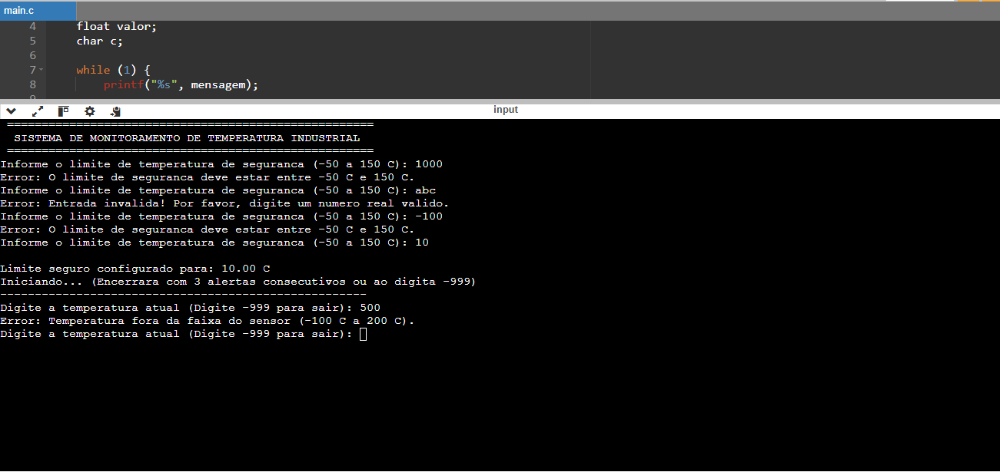
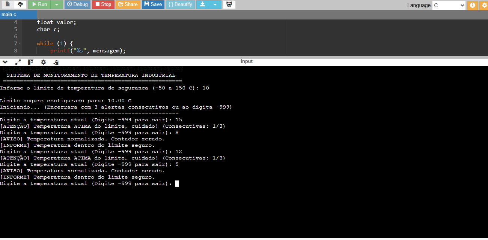
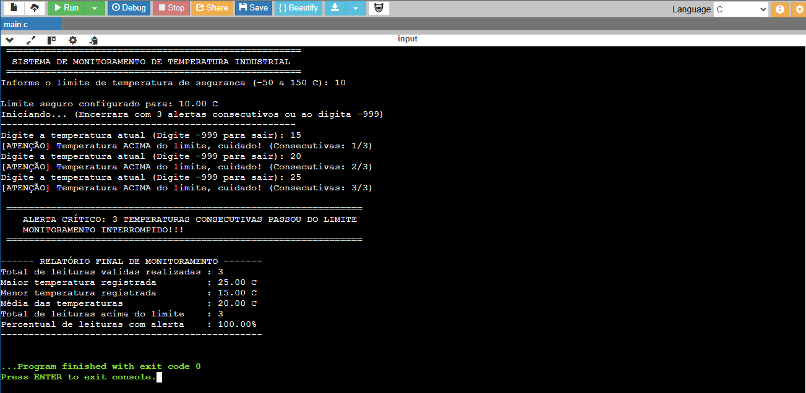
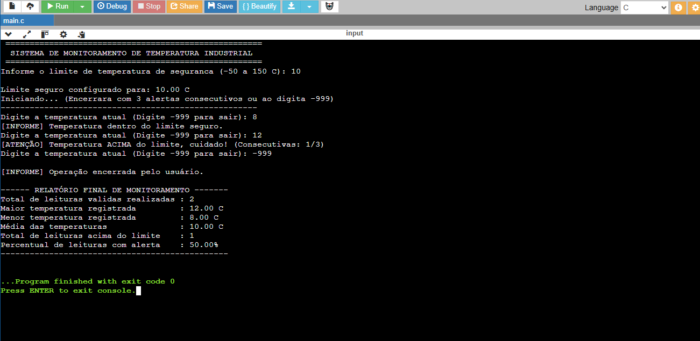

# Sistema de Monitoramento de Temperatura Industrial em C

**Aluno:** Vinícius Alves

**Disciplina:** Algoritmos e pensamento computacional

**Professora**: Profa. Karla Sartin

**Título do Projeto**: monitoramento.c

---

## Objetivo do Programa

O objetivo deste projeto é o desenvolvimento de um  **Sistema de Monitoramento e Controle de Temperatura Industrial em C**, projetado para ler leituras contínuas e aplicar regras automáticas de segurança. O programa oferecer uma interface no terminal com validação e tratamento contra entradas inválidas, cálculo de estatísticas, interrupção automática do sistema ao detectar situações críticas e opção de saída inteligente.

---

## Descrição do Funcionamento

O sistema é executado em duas etapas principais, utilizando as estruturas de repetição `do...while` e `while`:

1. **Configuração de Segurança (`do...while`):** O operador define o limite máximo de temperatura segura. O valor deve estar estritamente dentro da faixa de **-50 °C a 150 °C**. O laço obriga a digitação até que um limite válido seja configurado pelo usuário. 
2. **Monitoramento Contínuo (`while`):** O programa lê continuamente as leituras. O laço permanece ativo até que **3 leituras consecutivas acima do limite** sejam registradas, acionando o desligamento de emergência do programa ou caso o usuário deseja encerra o programa casa haja valores ele irá mostra as tabelas como os valores digitados e fecha caso contrário ele irá fechar mostrando que nenhuma valor foi digitado.

### Principais Recursos e Validações

* **Validação de Entrada com Limpeza de Buffer:** Implementação de função modular de leitura (`lerEntrada_float`) que valida números reais e limpa o *buffer* do teclado (`stdin`), rejeitando entradas com letras ou caracteres misturados ou diferentes do tipo da entrada.
* **Encerramento Manual:** Permite ao operador finalizar a medição a qualquer momento digitando `-999`.
* **Mecanismo de Alerta Consecutivo:** Contador de alertas de emergência que incrementa a cada temperatura acima do limite e **zera automaticamente** assim que a temperatura retorna ao nível seguro, prevenindo falsos alarmes.
* **Estatísticas e Relatório Final:** Ao encerrar por emergência, o sistema gera um relatório com total de leituras válidas, maior temperatura registrada, menor temperatura registrada, temperatura média e o percentual de leituras com alerta.

---

## Requisitos do Sistema e Estruturas Utilizadas

| Requisito / Conceito | Implementação no Código |
| :--- | :--- |
| **Entrada e Saída** | Utilização da biblioteca `<stdio.h>` para entrada (`scanf`/`getchar`) e exibição no terminal (`printf`). |
| **Estruturas de Repetição** | `do...while` para configuração do limite e `while` para o funcionamento do monitoramento contínuo. |
| **Estruturas Condicionais** | `if...else` para validação de faixas, atualização de maior/menor e controle do contador de alertas. |
| **Modularização** | Função dedicada `lerEntrada_float` responsável pela  leitura e tratamento de erros. |
| **Conversão de Tipos** | `(float)` no cálculo de percentuais para evitar divisão inteira. |
| **Encerramento Manual (`-999`)** | Parada imediata do monitoramento por solicitação do operador e exibição das estatísticas acumuladas. |

---

##  Evidências de Teste

Para validar o funcionamento do sistema e a robustez do tratamento de dados, foram executados 4 cenários de teste cobrindo todas as regras de negócio:

| Teste | Cenário Avaliado | Resultado Esperado |
| :---: | :--- | :--- |
| **01** | **Validação de Entradas Inválidas** | Recusa valores fora do limite, caracteres alfabéticos e valores fora do sensor sem travar o sistema. |
| **02** | **Alertas Não Consecutivos** | Incremento do contador ao ultrapassar o limite e reset automático após normalização da temperatura. |
| **03** | **Disparo de Emergência** | Interrupção automática e exibição do alerta crítico ao registrar 3 leituras consecutivas acima do limite. |
| **04** | **Encerramento Manual (`-999`)** | Parada imediata por solicitação do operador com geração das estatísticas dos dados acumulados durante a interação com o sistema. |


### Capturas de Tela das Execuções

#### Teste 1: Validação de Entradas Inválidas e Limites
> Teste de rejeição de letras (`abc`), limites de segurança inválidos (`1000` e `-100`) e limite do sensor (`500`).


#### Teste 2: Alertas Não Consecutivos (Reset do Contador)
> Teste da regra de normalização, provando que o contador zera ao ler uma temperatura segura.


#### Teste 3: Disparo de Emergência (3 Alertas Consecutivos)
> Teste do mecanismo ao atingir 3 estouros de limite seguidos.


#### Teste 4: Encerramento Manual pelo Operador
> Teste de saída antecipada utilizando o código `-999` exibindo o relatório final.



---

## Como Compilar e Executar

> Nota: Este método só funciona no Windows
 
1. Certifique-se de ter um compilador C instalado (como o **GCC**).
2. Abra o terminal na pasta onde o arquivo `monitoramento.c` está localizado.
3. Compile o arquivo 
   ```bash
   gcc -Wall -Wextra monitoramento.c -o monitoramento 
4. Execute  arquivo gerado `monitoramento.exe`
 
### Ou

1. Copie o código do arquivo `monitoramento.c`.
2. Abra um compilador de c online [OnlineGDB](https://www.onlinegdb.com/online_c_compiler)
3. Apague todo o código inicial.
4. Cole o código do `monitoramento.c`.
5. Execute o programa apertando F9. 
